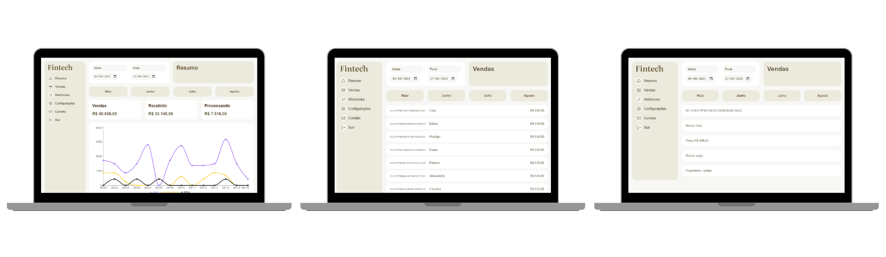
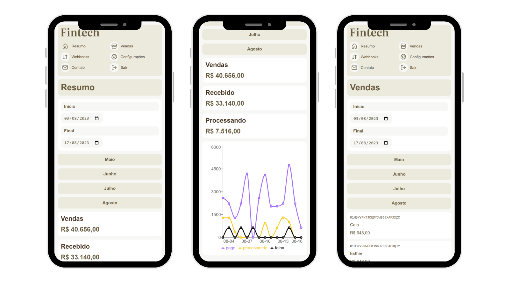

<h1 align="center">Fintech 💲📊</h1>

<div align="center">
  An application where it is possible to see through dashboards the financial data of a company.
</div>

<!-- <p align="center">
  <a href="https://todo-zeta-virid.vercel.app/">🔗 Visit this Project</a>
</p> -->

<!-- TABLE OF CONTENTS -->

## Table of Contents

- [Screens](#screens)
- [Built With](#built-with)
- [Features](#features)
- [How to use](#how-to-use)
- [Contact](#contact)

<!-- SCREENS -->

## Screens




<!-- BUILD WITH -->

## Built With

- [React](https://reactjs.org/)
- [TypeScript](https://www.typescriptlang.org/)
- [Recharts](https://recharts.org/en-US/)
- [Phosphor Icons](https://phosphoricons.com/)

<!-- FEATURES -->

## Features

- Filter financial data by the date you want
- Filter financial data by last three months
- View all sales
- View each sale in detail, with information such as: sale ID, customer name, price, sale status, and payment method.

<!-- HOW TO USE -->

## How To Use

To clone and run this application, you'll need [Git](https://git-scm.com) and [Node.js](https://nodejs.org/en/download/) (which comes with [npm](http://npmjs.com)) installed on your computer. From your command line:

```bash
# Clone this repository
$ git clone https://github.com/joaoliveirapb/fintech.git

# Install dependencies
$ npm install

# Run the app
$ npm run dev
```

<!-- CONTACT -->

## Contact

- E-mail [joaoliveira.batista1@gmail.com](mailto:joaoliveira.batista1@gmail.com)
- LinkedIn [João Oliveira](https://www.linkedin.com/in/joao-oliveira-preto-batista/)
- GitHub [@joaoliveirapb](https://github.com/joaoliveirapb)
